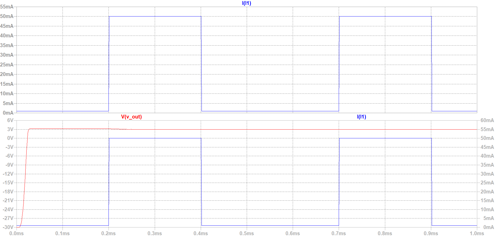
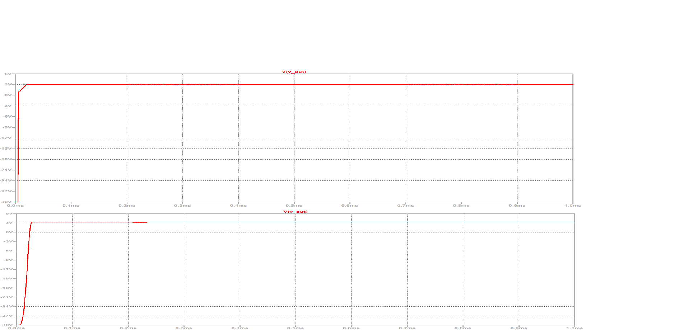
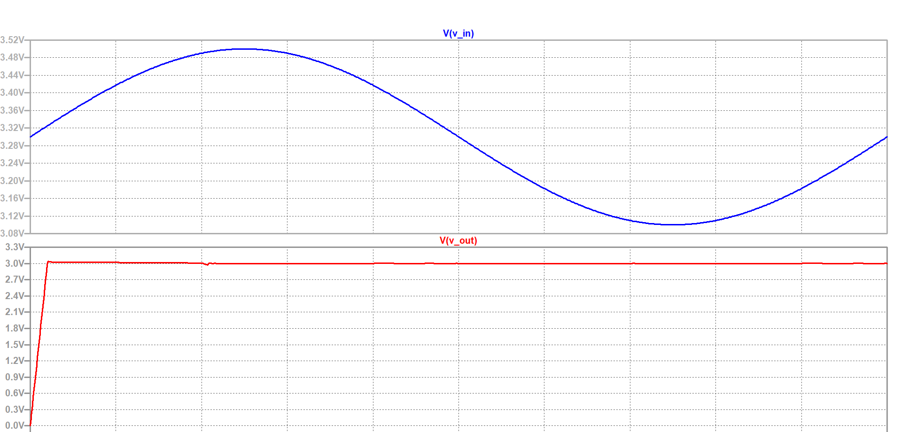
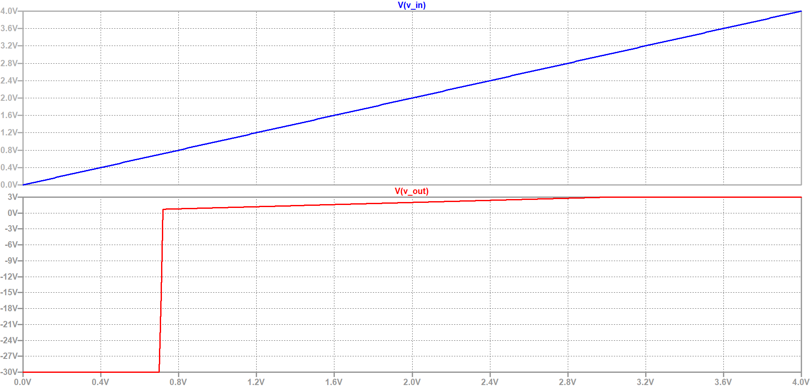

# 180nm-CMOS-LDO-Regulator
A PMOS-based LDO regulator designed for 3V output with stability analysis in LTspice.
# 180nm CMOS Low-Dropout (LDO) Regulator Design
**Developer:** Chinmaya Kumar Nanda (Roll: 124EE0091)  
**Institution:** NIT Rourkela  

## 📌 Project Overview
This project presents the design and stability analysis of a PMOS-based LDO regulator targeting a **3.0V output** from a **3.3V supply**. The design is optimized for high-current transient events (50mA), simulating the power requirements of a micro-robotics motor controller.

## 🛠 Design Specifications
* **Process Technology:** 180nm CMOS ($L=180n, W=5000u$)
* **Input Voltage ($V_{in}$):** 3.3V (Standard Lithium-Ion/Battery rail)
* **Output Voltage ($V_{out}$):** 3.0V (Regulated)
* **Load Step:** 1mA to 50mA (1µs Rise/Fall time)
* **Compensation:** 1µF Output Capacitor with 50mΩ ESR for frequency damping

---

## 📊 Simulation Results

### 1. Stable Load Transient Response
This plot shows the regulator's behavior during a 50mA "motor kick" event. Despite the sudden current demand, the feedback loop maintains regulation with minimal undershoot.

### 2. Stability Analysis: The Role of ESR
During initial testing, an ideal 1µF capacitor caused significant ringing (oscillations) at the 0.2ms mark. By introducing a **50mΩ ESR**, we added a left-half-plane zero to the system, successfully damping the response and improving the **Phase Margin**.

### 3. Line Regulation (PSRR Test)
To simulate a "noisy" battery, a 200mV ripple was added to the 3.3V source. The LDO effectively rejects this input noise, maintaining a flat 3.0V line for the sensitive downstream electronics.

### 4. DC Transfer & Dropout Characteristic
The DC sweep identifies the dropout region of the 180nm PMOS pass element. The regulator maintains a 3.0V output until the input drops below approximately 3.15V.

---

## 📂 Repository Structure
* **/Schematics**: Contains the `.asc` source files and custom `.asy` symbols.
* **/Simulation_Results**: High-resolution waveform captures.
* **/Models**: Custom SPICE models used for the 180nm PMOS transistor.

## 🚀 How to Run
1. Clone the repository.
2. Open `LDO_Testbench.asc` in LTspice.
3. Ensure the `opamp.sub` and `.model MY_PMOS` directives are present.
4. Run the Transient or DC sweep simulations to verify results.

